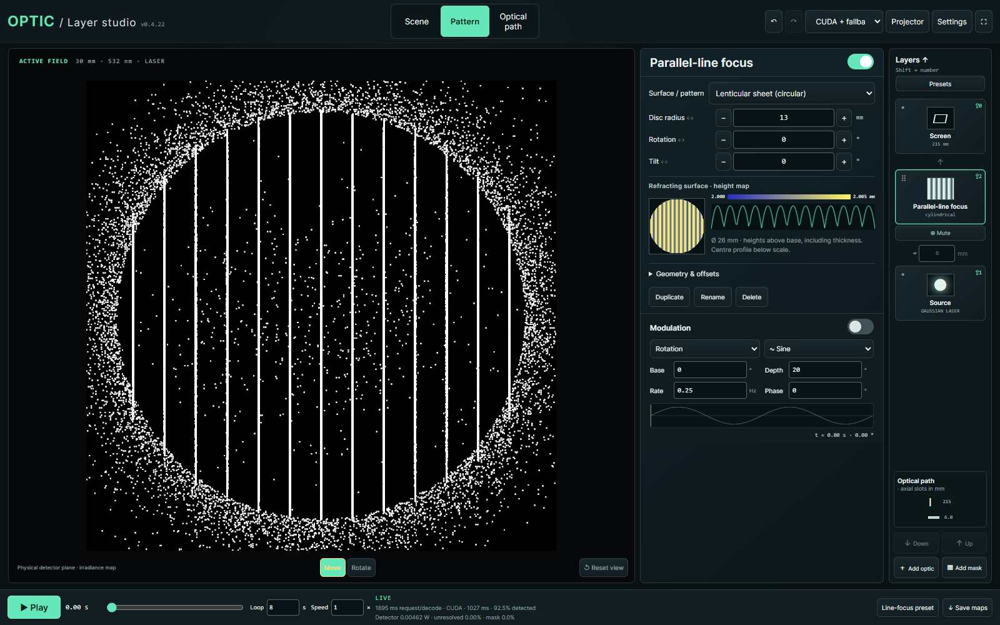
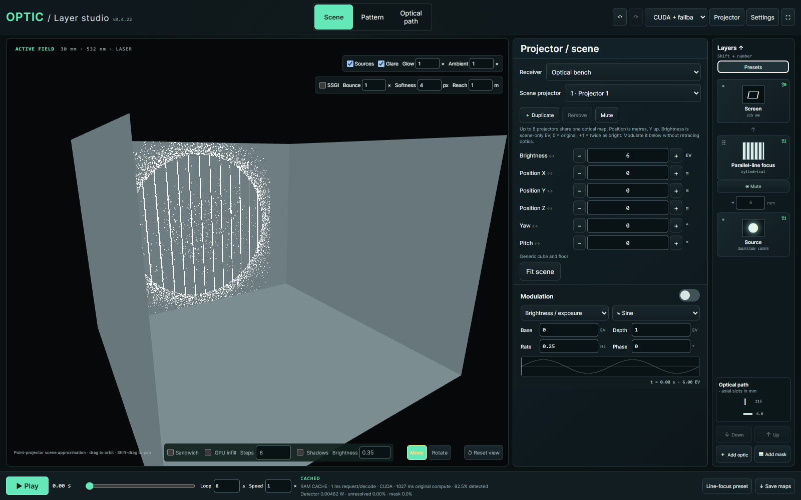
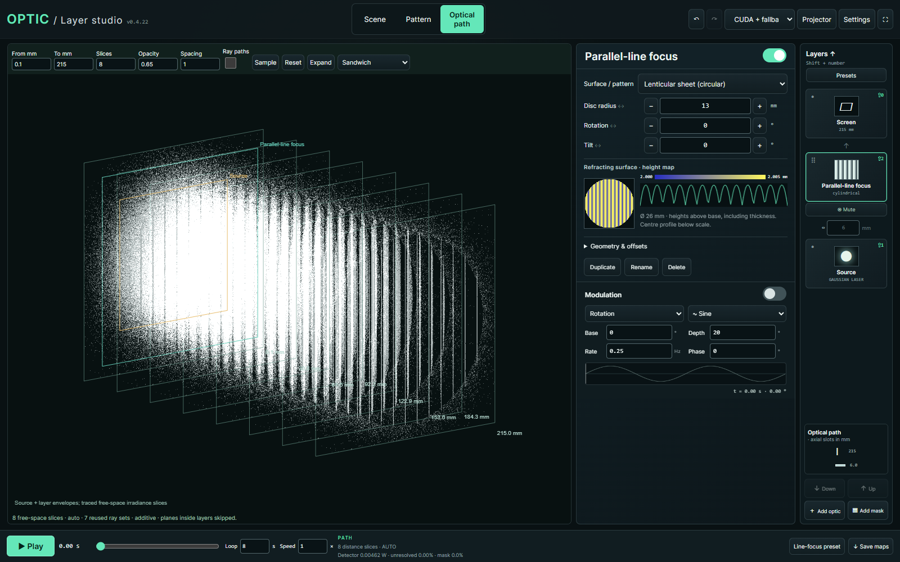
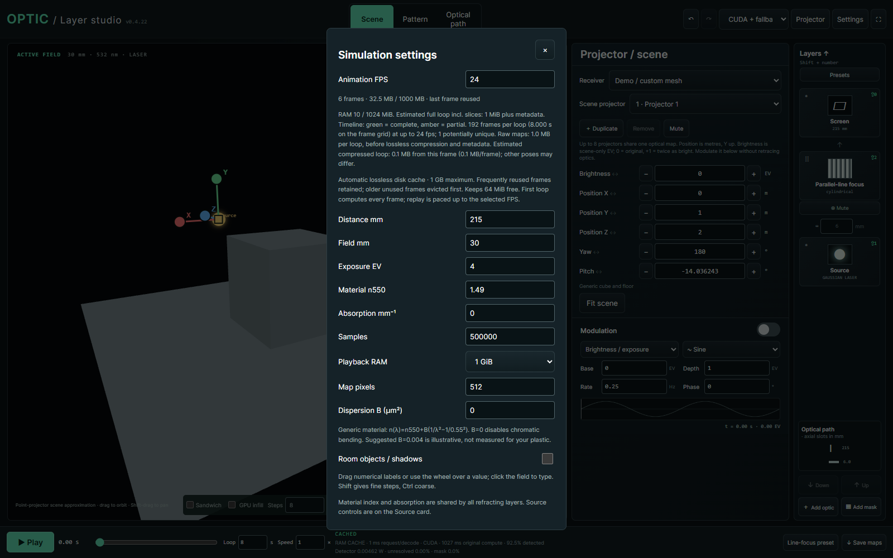
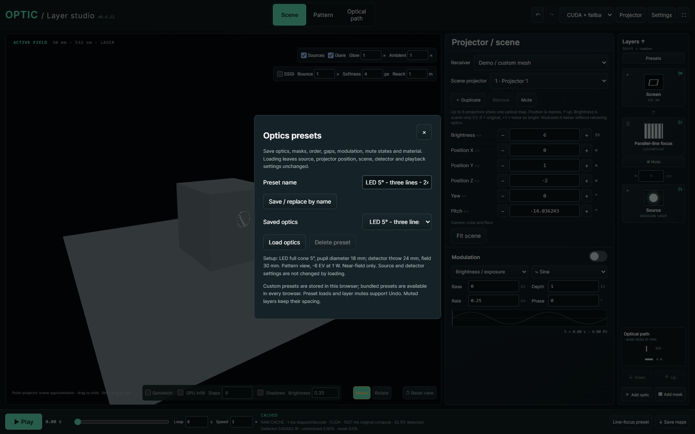

# Optic

A local optical-pattern simulator and interactive projection studio. Build stacks of refractive surfaces and masks, animate them, and preview their light on a detector or a 3D receiver.

## Screenshots

Actual captures from the app at 1600 × 1000. The line-focus example uses a geometric Gaussian laser and a lenticular sheet; visible grain comes from finite ray sampling.

### Pattern and optical-layer controls

Computed detector irradiance alongside the surface height map, layer stack and modulation controls.



### Scene and projector controls

The same optical map projected onto the bench, with source placement, brightness and viewport controls.



### Optical path

Computed distance slices show how the light evolves between the source and detector.



### Simulation settings and cache

Sampling, detector dimensions, material properties, playback RAM and disk-cache status.



### Optics presets

Save and load optical stacks independently of the source and scene settings.



## Run

Requires Python with NumPy, SciPy, Numba and Pillow, plus a browser supporting WebGL2.

```sh
python -m venv .venv
# Windows: .venv\Scripts\activate
# macOS/Linux: source .venv/bin/activate
python -m pip install -r requirements.txt
python app.py --port 8766
```

Open <http://127.0.0.1:8766>. Choose **CPU** or **Auto** in the compute controls if CUDA is unavailable. CUDA acceleration is optional and requires a compatible NVIDIA driver, CUDA toolkit and Numba environment. `CUDA_HOME` can identify a custom toolkit installation. The server is intended for local use.

## Features

- LED and Gaussian laser sources, spectral colors and adjustable beam profiles.
- Fresnel, lenticular, triangular-ridge, pyramid and fractured-glass surfaces; patterned masks, reorderable layers and optics presets.
- Background CPU/CUDA transport, animation, precomputation and bounded disk/RAM caches.
- Pattern, scene and optical-path views; multiple scene projectors, source gizmos, exposure modulation and GPU slice interpolation.
- Optional approximate glare and screen-space indirect lighting.

The bundled 3D scene is a small generic demo. To replace it, export a Blender scene from this directory:

```sh
blender --background --disable-autoexec your-scene.blend --python export_scene.py -- --output assets/demo-scene.json
```

Select **Demo / custom mesh** in the Projector inspector. Blender is only needed for exporting custom geometry. `python generate_demo_scene.py` restores the demo.

## Scope and accuracy

This is geometric ray transport for optical art prototyping. Laser mode does not simulate coherent interference or diffraction. Source/lens parameters and material profiles need measurements for predictive accuracy. Scene projection, slice blending, glare and SSGI are visualization approximations, not calibrated photometry.

See [technical notes](TECHNICAL-NOTES.md), [surface models](SURFACES.md), [scene controls](SCENE-PROJECTORS.md), [hybrid transport](HYBRID.md) and [change history](CHANGELOG.md).

## Tests

```sh
python -m pip install pytest
python -m pytest -q
node --test
```

Some transport checks require CUDA. Browser/WebGL checks are in `tests/` and can be opened through the local server.
